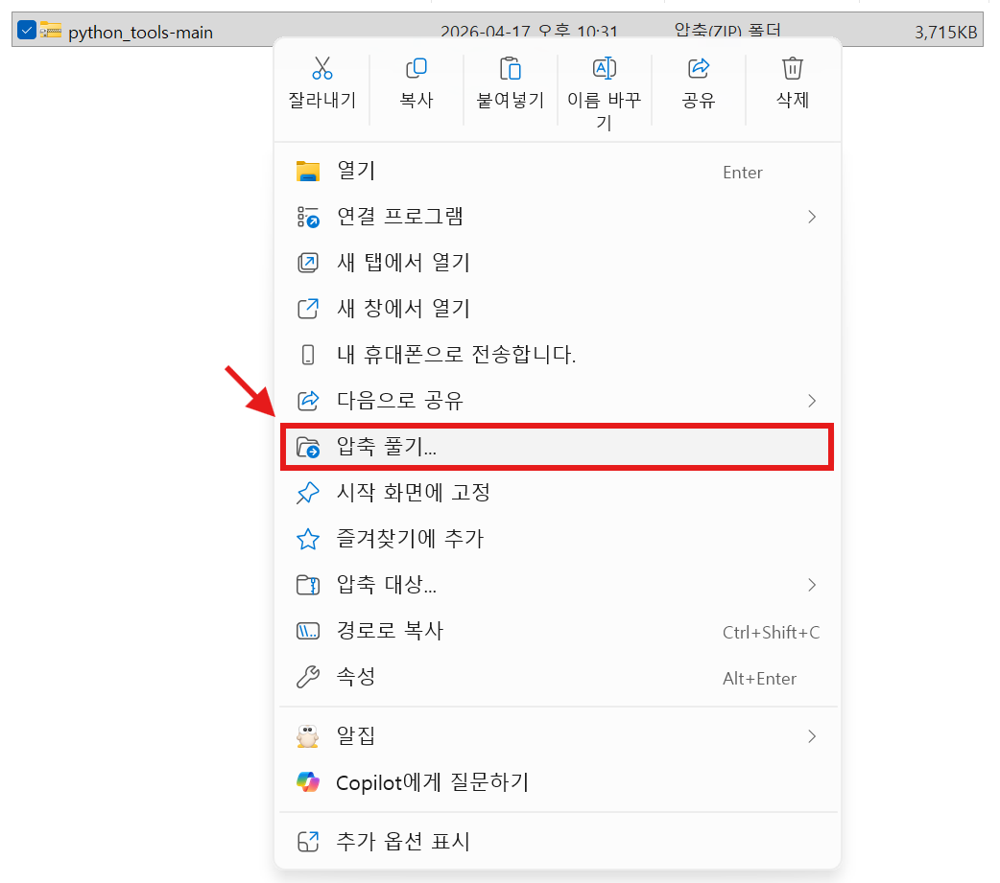
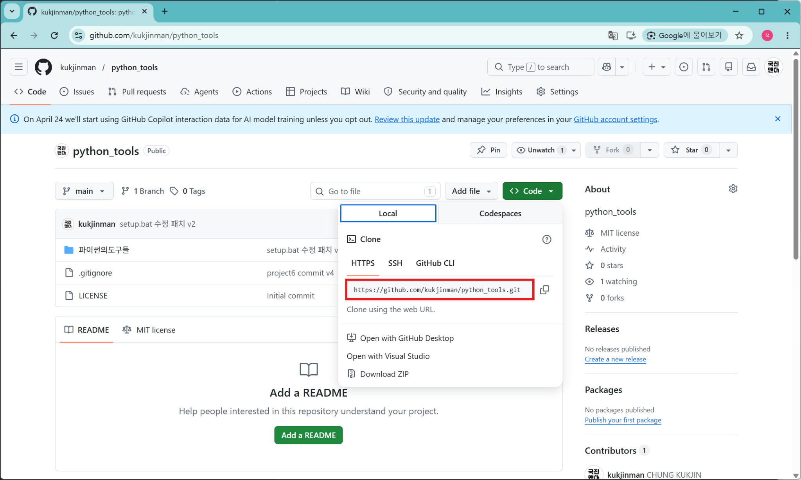
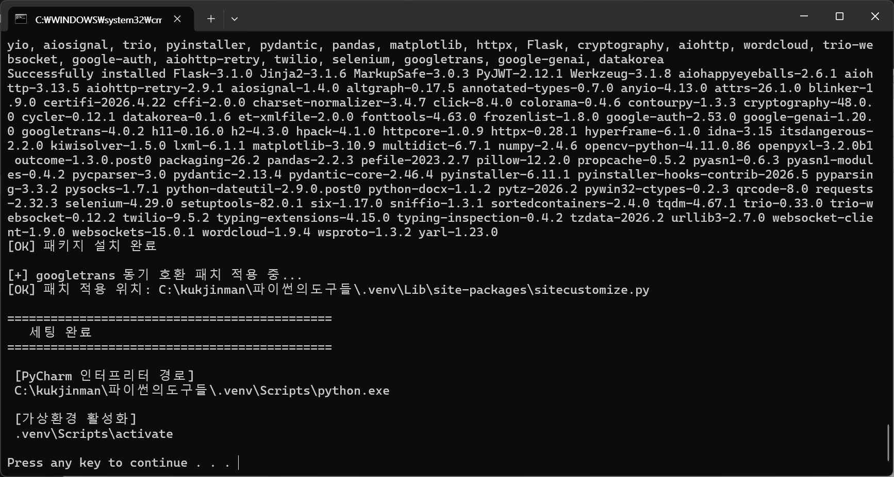
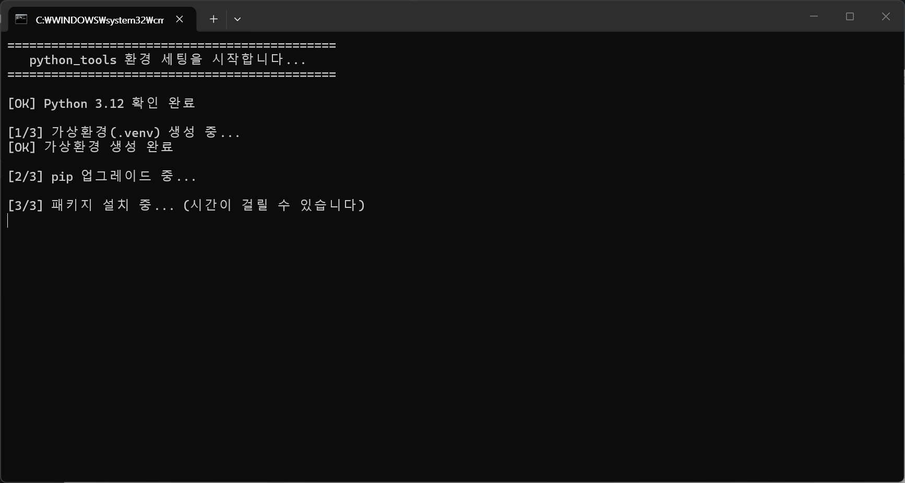
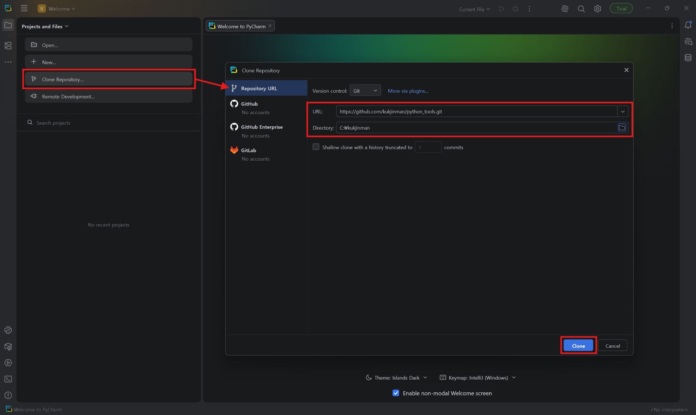

## 🛠️ 소스 코드 다운로드 및 환경 설정 방법

실습 진행을 위해 아래의 방법 중 하나를 선택하여 환경을 구축해 주세요. 프로젝트를 직접 빌드하고 실행하기 위해서는 **방법 2**를 강력히 권장합니다.

### 방법 1) ZIP 파일 다운로드 (단순 코드 참고용)
1. 웹 브라우저를 통해 GitHub 링크에 접속한 뒤 화면 우측 상단의 초록색 **`[<> Code]`** 버튼을 클릭하고, 나타나는 메뉴에서 **`[Download ZIP]`**을 선택하여 파일을 다운로드합니다.
2. 다운로드가 완료되면 해당 압축 파일 위에서 마우스 오른쪽 버튼을 눌러 **`[압축 풀기]`** 메뉴를 선택하여 압축을 해제합니다.

*▲ 웹 브라우저에서 ZIP 파일 다운로드 및 압축 해제 예시*

---

### 방법 2) Git Clone 및 개발 환경 세팅 (실습 및 실행용, 권장)
> ⚠️ **사전 준비**: 책 본문 1챕터의 안내에 따라 파이썬 3.12 및 파이참(PyCharm) 설치가 완료되어 있어야 합니다.

#### 1. Repository URL 복사 및 Clone
* 본 GitHub 저장소 상단의 `Code` 버튼을 눌러 Git Repository URL(`https://github.com/kukjinman/python_tools`)을 복사합니다.
* 1-3챕터에서 설치한 **PyCharm** 프로그램을 실행한 뒤 **`[Clone Repository]`**를 누르고, `URL`란에 복사해온 주소를 입력합니다. `Directory`에는 코드를 가져올 폴더 경로를 지정해 줍니다.

*▲ 파이참에서 Clone Repository 실행 및 URL 입력 화면*

#### 2. 프로젝트 신뢰 및 탐색기 열기
* PyCharm 내부에서 보안 관련 경고 창이 나타나면 **`[Trust Project]`**를 눌러줍니다.
* 왼쪽 프로젝트 탐색기창에서 `setup.bat` 파일에 마우스 오른쪽 버튼을 클릭하고 **`[Open In]` ➡️ `[Explorer]`**를 선택합니다.

*▲ Trust Project 선택 및 setup.bat 파일 탐색기 연동 화면*

#### 3. setup.bat 실행을 통한 패키지 자동 설치
* 실행된 윈도우 탐색기 폴더 안에서 **`setup.bat`** 배치 파일을 더블클릭으로 실행합니다.
* 책에 포함된 모든 도구(라이브러리)들의 패키지 설치가 자동으로 진행되며, 약 5분 정도 소요됩니다. 패키지 설치가 완료되면 아무 키나 눌러 창을 닫아줍니다.

*▲ setup.bat 배치 파일을 통한 필수 의존성 패키지 자동 설치 화면*

#### 4. 파이참 인터프리터(Interpreter) 설정 진입
* 파이참으로 돌아와 우측 상단의 톱니바퀴 버튼을 클릭하고 **`[Settings]`**를 누른 뒤, 왼쪽 검색창에 `Interpreter`를 검색하여 **`[Python Interpreter]`** 화면을 엽니다.
* 오른쪽 위의 **`[Add Interpreter]` ➡️ `[Add Local Interpreter...]`**를 순서대로 클릭합니다.

*▲ 파이참 설정 메뉴에서 Add Local Interpreter 진입 화면*

#### 5. 가상환경(.venv) 위치 변경 및 적용
* 새로 열린 설정 창에서 기존에 세팅되어 있는 프로젝트 경로를 우리가 Git Clone해와서 `setup.bat`으로 새로 만들어